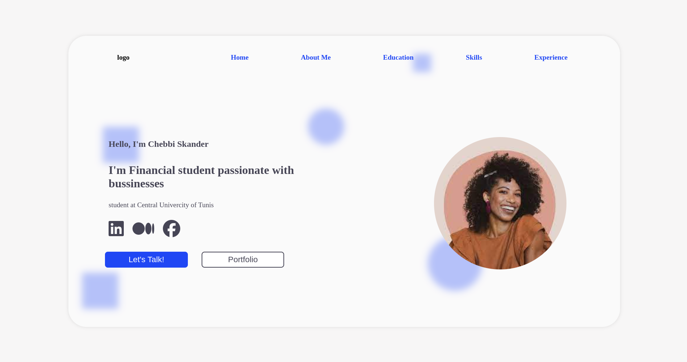
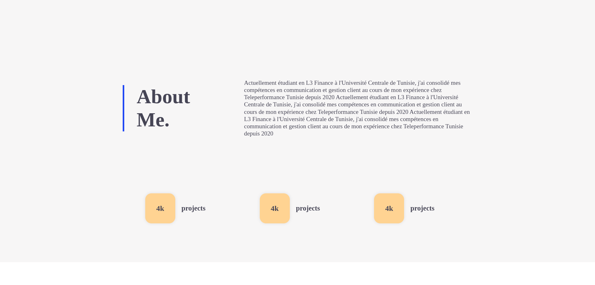
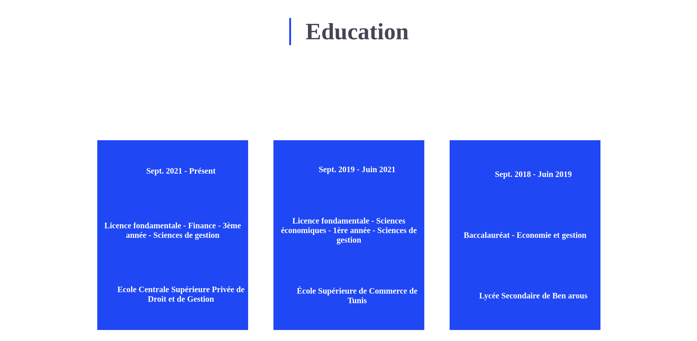
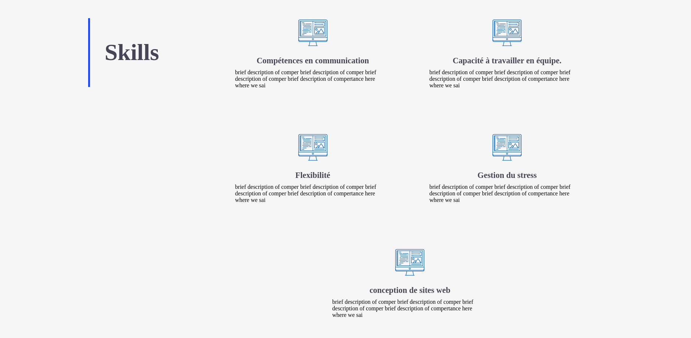
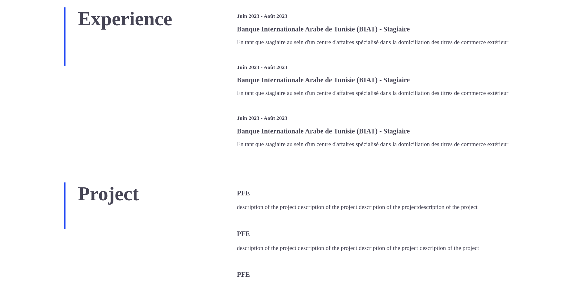
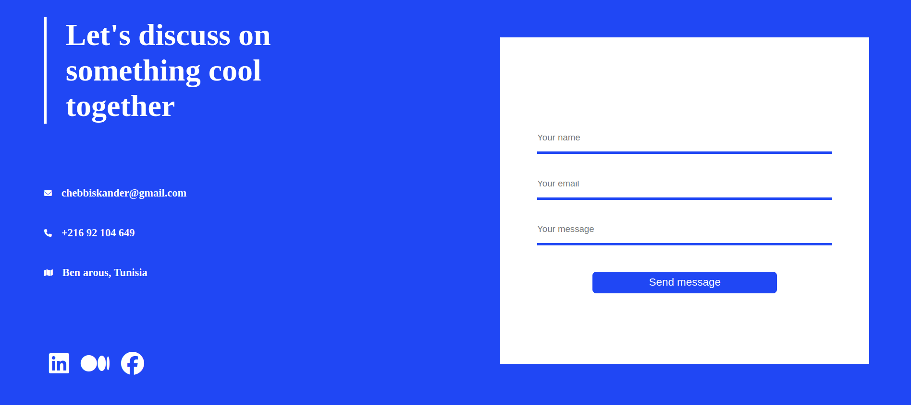

# Chebbi Skander's Finance Portfolio

Welcome to Chebbi Skander's finance portfolio! This repository showcases their skills, achievements, and projects related to the field of finance. This portfolio has been created by Othmani Amir as a representation of Chebbi Skander's work.

## About Chebbi Skander

Chebbi Skander is a [3rd Year] student pursuing a financial license. With a passion for finance and a commitment to excellence, Chebbi Skander aspires to [mention career goals or aspirations].

## Table of Contents

1. [Education](#education)
2. [Skills](#skills)
3. [Experience](#experience)
4. [Projects](#projects)
5. [Achievements](#achievements)
6. [Resume](#resume)
7. [Contact](#contact)
7. [Screenshots](#screen)

## Education

Chebbi Skander is currently pursuing a degree in finance at Central Univervercity of Tunis. Here are some details about their academic journey:

- Degree: [Degree Name]
- Graduation Date: [Expected Graduation Date]
- Relevant Coursework: [List of relevant courses]

## Skills

Chebbi Skander possesses skills in the finance domain, including:

- Financial Modeling
- Data Analysis
- Risk Management
- [Add more skills]

## Experience

In this section, Chebbi Skander highlights relevant work experience and internships.

- **[Company Name]** - *Position* (Month Year - Month Year)
  - [Brief description of responsibilities and achievements]

- **[Another Company Name]** - *Position* (Month Year - Month Year)
  - [Brief description of responsibilities and achievements]

## Projects

### [Project Name 1]

- **Description:** [Brief description of the project]
- **Role:** [Specify the role played in the project]
- **Technologies Used:** [List of technologies/tools used]
- **Link:** [Optional: Link to the project repository or live demo]

### [Project Name 2]

[Repeat the structure for each project]

## Achievements

- [Any notable academic or professional achievements]

## Resume

For a more detailed overview of Chebbi Skander's education, skills, and experience, you can view their [resume/CV](link-to-resume).

## Contact

Feel free to reach out to Chebbi Skander. They are open to collaboration, networking, and discussions about finance and related topics.

- Email: [Your Friend's Email Address]
- LinkedIn: [Your Friend's LinkedIn Profile]
- [GitHub](https://github.com/your-friends-username)

---

Thank you for visiting Chebbi Skander's finance portfolio! For inquiries or collaboration opportunities, feel free to reach out.

## Screenshots

